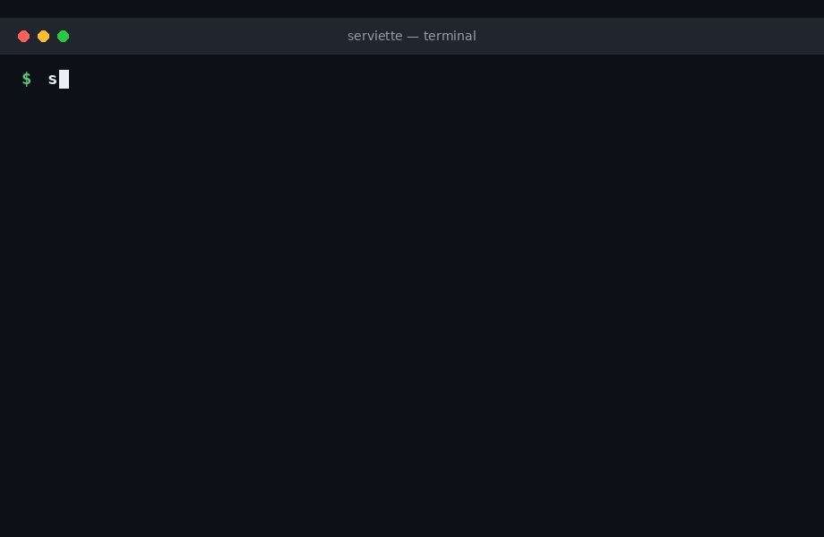
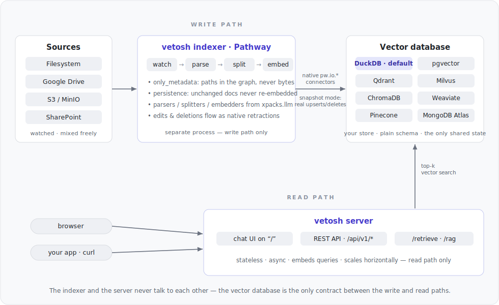
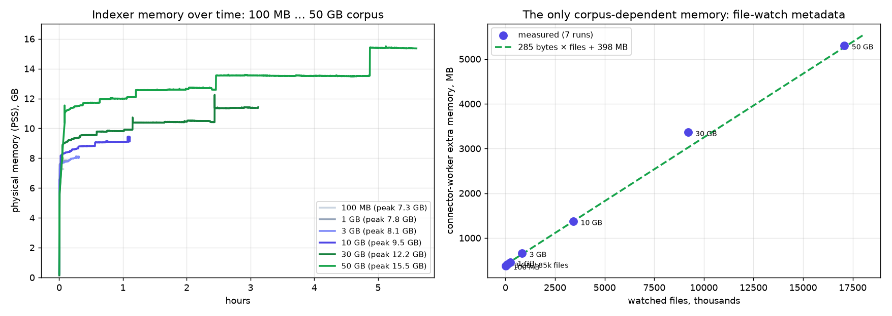
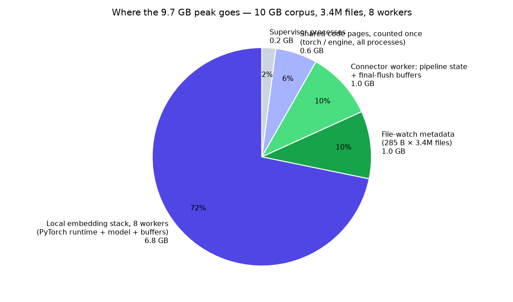

# vetosh

**A universal, no-code RAG server for any vector database — powered by the
[Pathway](https://pathway.com) Live Data Framework.**

Set up real-time Retrieval-Augmented Generation over your own documents without
writing any code. Point vetosh at a folder, pick a vector database and an
embedder in a YAML file, and run a few commands.

<p align="center">
  
</p>
<p align="center"><em>From zero to a live RAG stack — <code>quickstart → indexer → server → frontend</code> — then chat with your documents.</em></p>

```bash
pip install "vetosh[openai]"

vetosh quickstart                       # interactive config wizard
vetosh up --config config.yaml          # indexer + server together → http://localhost:8989
```

(Or run `vetosh indexer` and `vetosh server` separately — that is what `up`
supervises, and how production deployments split them.)

The server hosts both the web chat UI (on `/`) and the versioned REST API
(under `/api/v1`) on one port:

```bash
curl -X POST http://localhost:8989/api/v1/retrieve \
  -H 'Content-Type: application/json' \
  -d '{"query": "how does persistence work?", "k": 5}'
```

## Highlights

- **No code.** Configure everything in one YAML file (or generate it with
  `vetosh quickstart`).
- **Any vector DB — 8 backends.** DuckDB (embedded, zero setup — the default),
  pgvector, Qdrant, Milvus, ChromaDB, Weaviate, Pinecone and MongoDB Atlas
  Vector Search. Every backend is written through Pathway's **native
  `pw.io.*` connectors** in snapshot mode, so file edits and deletions become
  real upserts/deletes in the store.
- **Zero-setup default.** `type: duckdb` needs no external service and does
  vector search *inside the database* (`list_cosine_similarity` over native
  `DOUBLE[]` columns) — no linear scans in Python anywhere.
- **Live & incremental.** Built on Pathway: additions, edits and deletions are
  reflected in the vector DB in real time. Sources are read in `only_metadata`
  mode, so a large corpus stays tiny in the pipeline.
- **Multiple sources.** Local filesystem, Google Drive, S3/MinIO and
  SharePoint (all `only_metadata`), mixed freely in one config.
- **Reuses `pathway.xpacks.llm`.** Parsers, splitters and embedders are used
  as-is — vetosh implements none of its own. Five embedder families (OpenAI,
  LiteLLM, SentenceTransformers, Gemini, Bedrock) work identically on the
  indexer and the server side — including a fully local, credential-free
  stack with `sentence_transformer` + DuckDB.
- **Decoupled & scalable.** Indexer and API server are independent processes
  sharing only the vector DB; the server is stateless and scales horizontally.
- **Web chat UI, same port.** `vetosh server` serves a clean
  ChatGPT/Claude-style chat page on `/` next to the versioned API
  (`/api/v1/...`) — same origin, no CORS, nothing extra to run. For split
  deployments (UI on a different host) there is a standalone
  `vetosh frontend` proxy tier.
- **Free Pathway license.** One click at
  <https://pathway.com/framework/get-license>.

## Architecture

<p align="center">
  
</p>

**The two halves are fully decoupled.** The indexer (write path) and the
server (read path) are separate processes — different executables that never
talk to each other. Their only contract is the vector database itself:

- **Independent scaling.** The server is stateless and read-only — run any
  number of instances behind a load balancer; each also serves the chat UI at
  zero cost. The indexer scales separately with Pathway's multi-worker
  support. Bulk re-indexing never slows down query serving, and query spikes
  never stall indexing.
- **Failure isolation.** If the indexer is down, serving continues over the
  last-synced data; if the server is down, indexing keeps the database fresh.
  Either side can be restarted or upgraded independently (the indexer resumes
  from its persistence without re-embedding).
- **The database stays yours.** Vectors live in *your* store in a plain,
  documented schema — other consumers (BI, other apps, a different retrieval
  stack) can read the same collection; vetosh doesn't hold it hostage.
- **Optional third tier.** For split deployments (UI on a different host than
  the API) a standalone `vetosh frontend` serves the same chat page and
  proxies to the API server-side.

The one deliberate exception: the embedded DuckDB backend trades this
distribution for zero setup — one local file, single-writer, ideal for
laptops and demos (see [docs](docs/README.md) for its concurrency note).

## Benchmarks

Self-contained benchmark (docker-compose: Qdrant + indexer + server, fully
local embeddings, zero API cost) over a Wikipedia corpus —
see [benchmarks/realtime-data-indexing](benchmarks/realtime-data-indexing):

| corpus | ≈ pages | files | chunks | indexing time | peak memory (PSS) | in Qdrant | retrieval accuracy |
|---|---|---|---|---|---|---|---|
| 100 MB | 52 000 | 12 969 | 66 136 | 36 s | 7.3 GB | 0.6 GB | 5/5 |
| 1 GB | 524 000 | 240 516 | 836 595 | 5 min | 8.0 GB | 2.2 GB | 19/20 |
| 3 GB | 1 573 000 | 841 890 | 2 703 850 | 15 min | 8.3 GB | 6.0 GB | 16/20 |
| 10 GB | 5 243 000 | 3 423 359 | 10 093 514 | 63 min | 9.7 GB | 20.8 GB | 14/20 |
| 30 GB | 15 729 000 | 9 202 620 | 29 817 294 | 3.1 h | 12.5 GB | 61.3 GB | 12/20 |
| 50 GB | 26 214 000 | 17 083 603 | 53 913 774 | 5.6 h | 15.9 GB | 107.8 GB | 11/20 |

Documents flow through the pipeline rather than accumulating in it, so
what stays in memory is short and worth spelling out.

**Grows with the corpus — one thing.** The file-watch index: to detect live
edits and deletions, the indexer keeps a record (path, mtime, size, owner)
per watched file. Measured cost: **285 bytes per file**, verified from 13
thousand to 17 million files (right-hand plot: seven runs against the
formula; the 50 GB point lands within 1%). It scales with the *number of
files*, not bytes: the same 3 GB packed into 85k larger files needs 24 MB
instead of 240 MB.

**Constant, regardless of corpus size.** The embedding stack (PyTorch
runtime + model, per worker), the engine baseline (~200 MB per process),
connector machinery (~0.4 GB), and working buffers that reach a plateau in
the first minutes of a run and stay there — identical on 3 GB and 10 GB.

**On disk, not in memory.** Parsed-text cache, persistence snapshots, and
the embeddings themselves (in the vector database). That is why the curves
plateau: a **500× larger corpus costs 2.2× the memory** — and the growth
that remains is the file-watch index above, i.e. the corpus in fewer files
would cost less. Indexing time scales linearly with bytes throughout.

<p align="center">
  
</p>

The peak itself is dominated by the embedding stack, not the engine — a
Pathway worker process is ~200 MB; the rest is the price of running
embeddings locally (8 × PyTorch runtime + model), i.e. of paying no
per-token API fees. Fewer workers or an API embedder shrink it accordingly.

<p align="center">
  
</p>

Memory is measured as PSS (proportional set size) summed over the container:
shared pages — e.g. the PyTorch libraries mapped by every worker — are
counted once, not once per process. Setup: 96-core CPU host, streaming mode,
8 worker processes, local `static-retrieval-mrl-en-v1` embeddings (no API
calls; Matryoshka-truncated to 256 dims), 512-token chunks, Qdrant.

A note on the accuracy column. The benchmark is tuned for indexing
throughput, so it uses just about the fastest embedding model that exists: a
static one — a token-lookup table with no attention, truncated to 256
dimensions. That model is both the throughput bottleneck (embedding dominates
the indexing time above) and the accuracy ceiling: every logged miss is the
right article losing to a near-duplicate neighbour ("Anarchism" vs "Issues in
anarchism"), not a lost document — the pipeline indexed 100% of the corpus in
every run. Swap one config line for a stronger embedder and the accuracy
ceiling lifts with it, at proportional embedding cost; the engine numbers —
memory and everything outside embedding time — stay as measured.

## Requirements

Python ≥ 3.10 (the minimum supported by Pathway).

## Documentation

Full installation, quickstart, configuration reference, persistence,
architecture and scaling notes live in **[docs/README.md](docs/README.md)**.

## Development

```bash
pip install -e ".[dev,openai]"
pytest -m "not slow"            # fast unit tests (no Pathway, no services)
pytest -m "slow and not integration"   # end-to-end indexer tests (spin up Pathway)
pytest -m integration          # real-database tests (see below)
pytest                         # everything
```

Per-backend clients install as extras — pick what you use:

```bash
pip install "vetosh[qdrant]"      # also: pgvector, milvus, chroma, weaviate,
                                  #       pinecone, mongodb, local, gemini, all
```

### Integration tests (real databases)

**Every claimed backend has an integration test** running the same scenario
end-to-end against a real instance: index two documents with the real indexer,
retrieve through the production accessor (exact-text query must rank first
with cosine ~1.0), delete a file, re-index, and verify its vectors are gone
(snapshot semantics). The shared driver lives in `tests/integration_common.py`.

| Backend | Test | Real instance |
|---|---|---|
| DuckDB | `test_integration_duckdb.py` | embedded — runs everywhere |
| pgvector | `test_integration_pgvector.py` | `pgvector/pgvector` Docker container |
| Milvus | `test_integration_milvus.py` | embedded Milvus Lite engine |
| Qdrant | `test_integration_qdrant.py` | `qdrant/qdrant` Docker container |
| ChromaDB | `test_integration_chroma.py` | `chromadb/chroma` Docker container |
| Weaviate | `test_integration_weaviate.py` | `semitechnologies/weaviate` Docker container |
| Pinecone | `test_integration_pinecone.py` | official `pinecone-local` emulator (Docker) |
| MongoDB | `test_integration_mongodb.py` | `mongodb-atlas-local` (mongod + mongot, real `$vectorSearch`) |

Containers are throwaway (`tests/dockerutil.py`, Docker CLI via subprocess, no
extra dependency) and host ports are **allocated dynamically** — tests never
assume a fixed localhost port is free or that a service is already running.
Each test skips automatically when Docker or its client library is missing.

## License

See [LICENSE](LICENSE).
